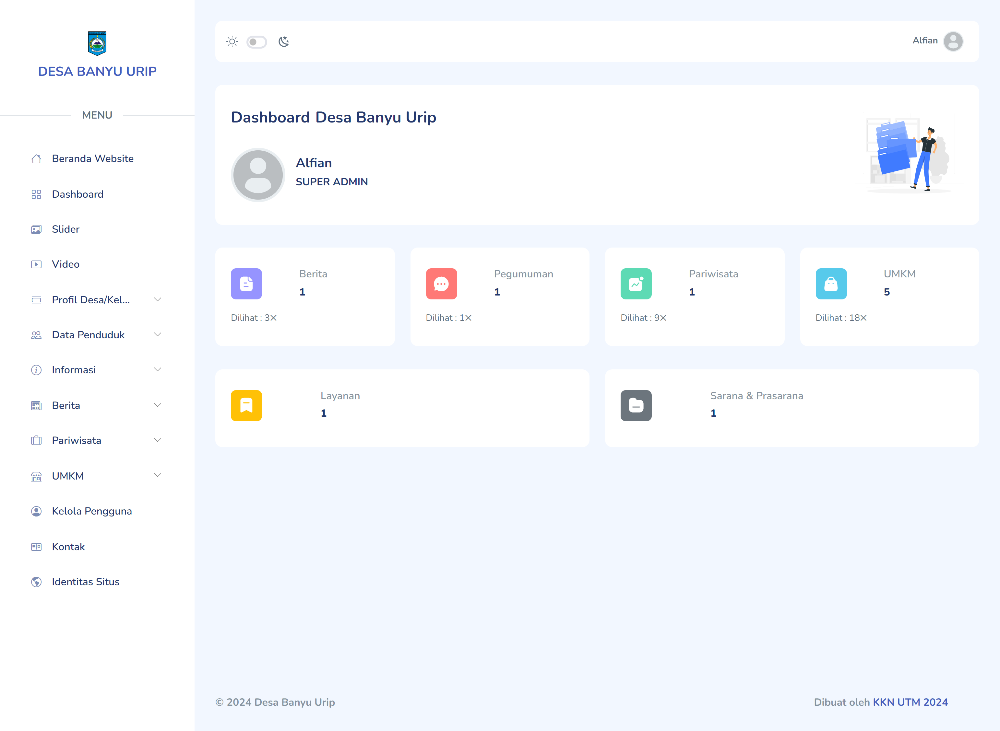

# Village Portal Website

Selamat datang di proyek **Village Portal Website**! 🎉 Proyek ini dibangun menggunakan CodeIgniter 4, proyek ini merupakan program kerja KKN UTM 2024 di desa Banyu Urip Kabupaten Lombok Barat. Aplikasi ini memanfaatkan template dashboard **Mazer** dan **Myth-Auth** untuk fitur login dan register.

## 🖥️ Screenshot

1. Landing Page


2. Dashboard


## ✨ Fitur

1. **Login Multi-User**: Superadmin, Admin, Kepala Desa/Lurah, Perangkat Desa, dan Kepala Dusun/Lingkungan.
2. **Manage Users**: Hanya bisa diakses oleh Super Admin dan Admin.
3. **Manage Profil Desa**: Tentang, Geografis, STOK, Aparatur, dan Kewilayahan.
4. **Manage Informasi Desa**: Pengumuman, Layanan, Sarana/Prasarana, Dokumen Publik, dan Data Penduduk.
5. **Manage Berita**: CRUD Data Berita.
6. **Manage Pariwisata**: CRUD Data Pariwisata.
7. **Manage UMKM**: CRUD Data UMKM.
8. **Manage Situs**: Slider, Video, Kontak, dan Identitas Situs.

## 🚀 Teknologi yang Digunakan

-  **CodeIgniter 4.4**: Framework PHP untuk membangun aplikasi web.
- **Mazer Dashboard**: Template dashboard responsif dan komponen UI base on **Boostrap 5**.

## 📦 Instalasi

1. **Clone Repository**:
    ```bash
    git clone https://github.com/alfian742/village_website.git
    ```

2. **Masuk ke Direktori Proyek**:
    ```bash
    cd village_website
    ```

3. **Update Dependensi**:
    ```bash
    composer update
    ```

4. **Konfigurasi ENV**:
    - Ubah nama `.env.example` menjadi `.env`.
    - Lakukan konfigurasi sesuai kebutuhan.

5. **Konfigurasi ENV**:
   - Buat database sesuai dengan konfigurasi ENV.

7. **Migrate Database dan Seeder**:
    ```bash
    php spark migrate
    ```

   ```bash
    php spark migrate -all 
    ```

   ```bash
    php spark db:seed MainSeeder
    ```

8. **Jalankan Aplikasi**:
    ```bash
    php spark serve
    ```
    - Akses aplikasi di browser melalui URL: `http://localhost:8080`.

## 📖 Panduan Penggunaan

1. **Login**:
   - Gunakan kredensial berikut untuk login ke aplikasi:
   - Super Admin
     - **Username**: `superadmin`
     - **Password**: `superaadmin`
   - Admin
     - **Username**: `admin`
     - **Password**: `admin`
   - Kepala Desa/Lurah
     - **Username**: `kades`
     - **Password**: `kades`
   - Perangkat Desa
     - **Username**: `staff`
     - **Password**: `staff`
   - Kepala Dusun/Kepala Lingkungan
     - **Username**: `kadus`
     - **Password**: `kadus`

2. **Konfigurasi Login (Opsional)**:
   - Konfigurasi dapat dilakukan pada direktori `vendor/myth/auth/src`.

---

Terima kasih telah mengunjungi repositori ini! Jika ada pertanyaan atau saran, jangan ragu untuk menghubungi saya.
